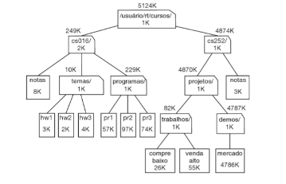
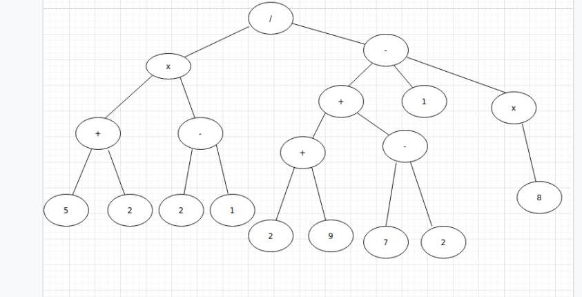

# Ac4 de estrutura de dados

## Integrantes do grupo:

*  Erick Samuel Salazar do Carmo RA 1905066
*  Erik Danton Ozzetti Martins RA 1905319
*  Guilherme Augusto da Silva Costa RA 1905030
*  Gustavo Matoso de Oliveira RA 1905058
*  Israel Tavares Ribeiro RA 1905029
*  Weslley Schunemann RA 1904751

Questões:

- [x] 1 As questões a seguir são relativas à árvore Abaixo.

  

      a) Qual nodo é a raiz?
          R: "/usuário/rt/cursos/"

      b) Quais são os nodos internos?
          R: "cs016/", "temas/", "programas/", "cs252/", "projetos/", "trabalhos/", "demos/"

      c) Quantos descendentes tem o nodo cs016/?
          R: "cs016/" tem 9 descendentes, sendo eles: "cs016/", "temas/", "hw1", "hw2", "hw3", "programas/", "pr1", "pr2", "pr3"

      d) Quantos ancestrais tem o nodo cs016/?
          R: "cs016/" tem 1 ancestral, sendo ele "/usuário/rt/cursos/"

      e) Quais são os irmãos do nodo temas/?
          R: "notas" e "programa/" 

      f) Que nodos pertencem à subárvore com raiz no nodo projetos/?
          R: "projetos/", "trabalhos/, "compre baixo", "venda alto", "demos/", "mercado"

      g) Qual é a profundidade do nodo trabalhos/ ?
          R: A profundidade é 3

      h) Qual a altura da árvore?
          R: A altura da árvore é 4

- [x] 2 Implementação e teste da Árvore Genérica conforme os slides de 23 a 33.

- [x] 3 Incrementar a implementação e teste de LinkedTree<E> com os seguintes métodos:

      a) parentheticRepresentation conforme o algoritmo do slide 55.

      b) Com base no algoritmo posorder (slide 57) crie o método toStringPostorder (imprime os valores dos nodes visitados).

      c) diskSpace conforme o algoritmo do slide 80.

      d)depth conforme o algoritmo do slide 84.

      e)height1 conforme o algoritmo do slide 90.

      f)height2 conforme o algoritmo do slide 103.

- [x] 4 Implemente e teste o TAD Árvore Binária conforme slides de 15 a 26

- [x] 5 Incremente a implementação e teste do TAD Árvore Binária com:
  
      a) buildExpression conforme slide 30.

      b) binaryPreorder conforme slide 31.

      c) binaryPostorder conforme slide 32.

      d) evaluateExpression conforme slide 34 a 42.

      e) inorder conforme slide 43.

      f) makerBTSearch e exiba o seu caminhamento inorder conforme slide 45.

      g) Método que desenhe a árvore binária de expressão conforme slide 47.

      h) eulerTour conforme slide 51.

      i) printExpression conforme slide 53.

      j) Método para contar os nodos esquerdos e externos de uma árvore binária.

      k) Método para contar os nodos direitos e externos de uma árvore binária.

- [x]  6 Desenhe uma árvore binária que represente a seguinte expressão aritmética:
  “(((5+2)*(2-1))/((2+9)+(7-2)-1)*8)”.
  
